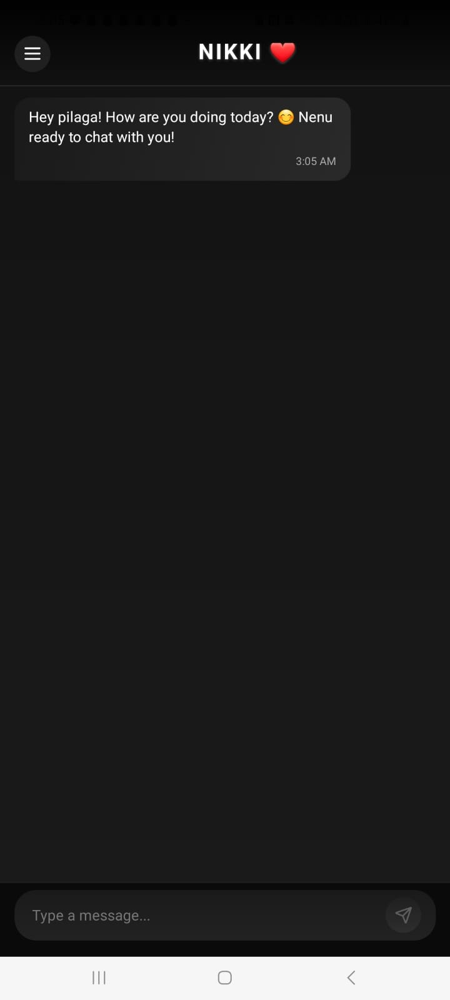

# AI Girlfriend Chat (Telugu) - React Native Expo

## Overview

This project is an AI-powered virtual girlfriend that interacts with users in Telugu. It leverages the **Gemini API** to provide intelligent and engaging conversations. Built using **React Native Expo**, this app ensures a seamless cross-platform experience on both Android and iOS.

Installation Link: https://www.nickthelegend.tech/NikkiBot.apk



## Features

- AI-based Telugu conversation
- Real-time responses using **Gemini API**
- User-friendly interface
- Built with **React Native Expo** for smooth performance


## Technologies Used

- **React Native** (Expo framework)
- **Gemini API** (for AI conversations)
- **JavaScript/TypeScript** (for app logic and UI)
- **Node.js** (for backend API integration, if applicable)

## Installation

1. Clone the repository:
   ```sh
   git clone https://github.com/nickthelegend/nikki-bot.git
   cd nikki-bot
   ```
2. Install dependencies:
   ```sh
   npm install
   ```
3. Start the Expo development server:
   ```sh
   expo start
   ```
4. Scan the QR code with the **Expo Go** app on your mobile device to run the application.

## Usage

- Open the app and start chatting in Telugu.
- The AI will respond naturally based on the input.
- Enjoy an engaging conversation with your virtual AI girlfriend!

## Configuration

- To use the **Gemini API**, obtain an API key from Google and add it to your project:

  ```sh
  export GEMINI_API_KEY=your_api_key_here
  ```

  Or, create an `.env` file:
  ```sh
  GEMINI_API_KEY=your_api_key_here
  ```

## Future Enhancements

- Voice chat support
- Customizable AI personality
- Multi-language support
- Advanced AI training for deeper conversations

## Contributing

Contributions are welcome! Feel free to submit pull requests or open issues.

## License

This project is licensed under the **MIT License**.

## Contact

For any queries or suggestions, reach out at: **testingtesla7@gmail.com**
